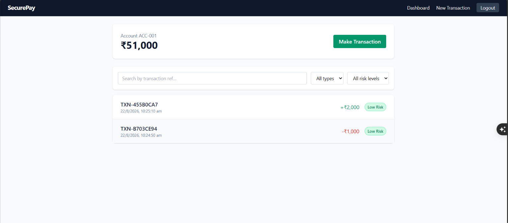
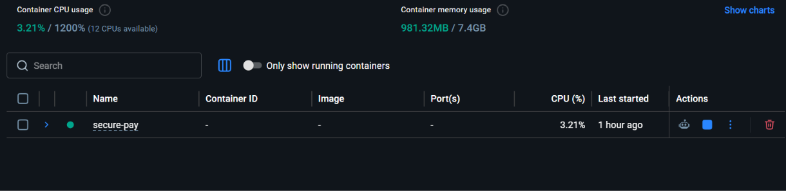

# SecurePay — Transaction & Fraud Investigation Platform

A polyglot microservices project: a **Java Spring Boot** transaction API, an **event-driven fraud pipeline** over **Kafka**, a **Python agentic Fraud Investigation Agent**, and a **React dashboard** on top.

> **Status: MVP / demo-grade.** Built as a portfolio project — auth, transactions, and the fraud pipeline are functionally real and run end-to-end via Docker Compose. 
---
## 📸 Screenshots

### SecurePay Dashboard


### Docker Desktop - build


### Docker Images


---


## 1. What SecurePay Does

SecurePay is a small transaction-processing service with built-in fraud triage:

1. A user creates a transaction (debit/credit) against an account via the REST API or dashboard.
2. If the amount crosses a configurable threshold, the transaction is published as an event to Kafka instead of being risk-scored inline.
3. A **Fraud Investigation Agent** (Python) consumes the event, calls a small set of internal "tools" (account lookup, transaction history, a risk-scoring engine, a rules engine), and produces a structured, explainable verdict: `HIGH_RISK` or `LOW_RISK`.
4. The backend updates the transaction's risk status, and the dashboard reflects polling live if the transaction is still under review.
5. An admin-only dashboard lists all flagged transactions for manual fraud monitoring.

---

## 2. Architecture

```
                     ┌─────────────────┐
                     │  React Frontend │
                     │  (Vite + Tailwind)
                     └────────┬────────┘
                              │ REST (JWT)
                              ▼
                     ┌─────────────────┐
                     │  Spring Boot API │
                     │  Auth · Accounts │
                     │  Transactions    │
                     └───┬─────────┬────┘
                         │         │
                 JPA/SQL │         │ publishes on threshold breach
                         ▼         ▼
                  ┌───────────┐  ┌──────────────┐
                  │ PostgreSQL│  │ Kafka topic: │
                  │           │  │ fraud-alerts │
                  └───────────┘  └──────┬───────┘
                                        │ consumes
                                        ▼
                          ┌──────────────────────────┐
                          │ Fraud Investigation Agent │
                          │ (Python / FastAPI)        │
                          │                            │
                          │  Tools:                   │
                          │   - get_account_info       │
                          │   - get_transaction_history │
                          │   - run_risk_engine         │
                          │   - apply_rules_engine      │
                          │                            │
                          │  → structured verdict      │
                          └──────────┬─────────────────┘
                                     │ REST callback
                                     ▼
                          Spring Boot updates riskStatus
                          on the Transaction record
```

---

## 3. Tech Stack

| Layer | Technology |
|---|---|
| Backend API | Java 17, Spring Boot 3, Spring Security, Spring Data JPA, Spring Kafka |
| Auth | JWT (jjwt), BCrypt password hashing, role-based access (`USER` / `ADMIN`) |
| Database | PostgreSQL |
| Messaging | Apache Kafka (Confluent images via Docker Compose) |
| AI / Agent | Python 3.11, FastAPI, a custom tool-calling agent orchestrator (optional Groq LLM narration layer) |
| Frontend | React 18, Vite, React Router, Tailwind CSS |
| DevOps | Docker, Docker Compose, GitHub Actions CI, Nginx (frontend serving) |
| Testing | JUnit 5 + Mockito (backend), Pytest (AI agent) |

---

## 4. API Endpoints

| Method | Path | Auth | Description |
|---|---|---|---|
| POST | `/api/auth/register` | Public | Create a user account |
| POST | `/api/auth/login` | Public | Get a JWT |
| GET | `/api/accounts/{accountNumber}` | Bearer | Fetch account + balance |
| POST | `/api/accounts` | Bearer | Create an account |
| POST | `/api/transactions` | Bearer | Create a transaction (triggers fraud check if over threshold) |
| GET | `/api/transactions/{transactionRef}` | Bearer | Fetch one transaction |
| GET | `/api/transactions/account/{accountNumber}` | Bearer | Paginated transaction history |
| GET | `/api/admin/flagged` | Bearer, `ROLE_ADMIN` | All transactions, for the fraud-monitoring dashboard |

**Example — create a transaction:**
```bash
curl -X POST http://localhost:8080/api/transactions \
  -H "Authorization: Bearer $TOKEN" \
  -H "Content-Type: application/json" \
  -d '{"accountNumber":"ACC-001","amount":150000,"type":"DEBIT"}'
```

**AI Agent — direct call (for debugging):**
```bash
curl -X POST http://localhost:8000/investigate \
  -H "Content-Type: application/json" \
  -d '{"transactionRef":"TXN-DEMO","accountNumber":"ACC-001","amount":150000,"type":"DEBIT"}'
```

---

## 5. Database Design

**account**
| Column | Type |
|---|---|
| id | bigint, PK |
| account_number | varchar, unique |
| owner_name | varchar |
| balance | numeric |
| owner_user_id | bigint, FK → app_user.id (nullable) |

**transaction**
| Column | Type |
|---|---|
| id | bigint, PK |
| transaction_ref | varchar, unique |
| account_id | bigint, FK → account.id |
| amount | numeric |
| type | varchar (`DEBIT` / `CREDIT`) |
| created_at | timestamp |
| risk_status | varchar (`PENDING` / `LOW_RISK` / `HIGH_RISK`) |

**app_user**
| Column | Type |
|---|---|
| id | bigint, PK |
| username | varchar, unique |
| password | varchar (BCrypt hash) |
| role | varchar (`USER` / `ADMIN`) |

Schema is created/updated automatically by Hibernate (`ddl-auto: update`) — fine for a demo, swap for Flyway/Liquibase migrations before anything resembling production.

---

## 6. Kafka Flow

- **Topic:** `fraud-alerts`, 3 partitions, replication factor 1 (single-broker dev setup).
- **Producer:** `TransactionService` publishes a `FraudAlertEvent` (transaction ref, account, amount, type, timestamp) only when `amount >= app.fraud.amount-threshold` (default ₹100,000, configurable via env var).
- **Consumer:** `FraudEventConsumer` in the backend listens on `fraud-alerts`, calls the Python agent's `/investigate` endpoint synchronously, then updates the transaction's `riskStatus`.
- **Fail-safe:** if the AI agent is unreachable, the consumer defaults the transaction to `HIGH_RISK` rather than silently leaving it unresolved — a flagged transaction is never dropped.

---

## 7. Security Measures

- **Authentication:** JWT (HS256), stateless sessions, `Authorization: Bearer <token>`.
- **Password storage:** BCrypt, never stored or logged in plaintext.
- **Authorization:** role-based access control — `/api/admin/**` requires `ROLE_ADMIN`.
- **Input validation:** Bean Validation (`@NotBlank`, `@DecimalMin`, `@Pattern`) on all request DTOs, rejecting malformed input before it reaches business logic.
- **Rate limiting:** a lightweight in-memory fixed-window filter (60 req/min/IP by default) to blunt brute-force and scraping attempts.
- **Error handling:** a global exception handler that never echoes raw exception messages or stack traces to the client (OWASP A05: Security Misconfiguration).
- **SQL injection:** all data access goes through Spring Data JPA / parameterized queries — no string-concatenated SQL anywhere.
- **Secrets:** JWT secret and DB credentials are read from environment variables (`.env`, not committed), never hardcoded.

**Known gaps to close before this is production-grade:** no refresh-token rotation, no account lockout after repeated failed logins, no HTTPS termination configured (add via a reverse proxy), and the rate limiter is per-instance (fine for one replica, not for a scaled deployment).

---

## 8. AI / Fraud Detection Approach

The **Fraud Investigation Agent** is a tool-calling pipeline, not a black-box classifier:

1. `get_account_info` — account age, historical average transaction size, KYC status
2. `get_transaction_history` — recent transactions for pattern comparison
3. `run_risk_engine` — a transparent, rule-based heuristic score in `[0, 1]`, based on deviation from typical transaction size and account age (swap in a trained model like `IsolationForest` behind the same function signature without touching the agent's orchestration logic)
4. `apply_rules_engine` — hard business rules (unverified KYC, regulatory amount limits, repeated large transactions) that can force a `HIGH_RISK` verdict regardless of the heuristic score

The agent compiles these into a structured, explainable summary. An **optional LLM narration step** (Groq's OpenAI-compatible API, `GROQ_API_KEY` env var) can rewrite the structured finding as natural language — but the risk verdict itself never depends on the LLM being available, so the agent degrades gracefully if that call fails or the key isn't set.

This design was chosen deliberately over "call an LLM and hope for a good answer": every verdict is traceable back to concrete tool outputs, which matters a lot more for a fraud system than fluent prose.

---


## Project Structure
```
secure-pay/
├── backend/       # Spring Boot REST API
├── ai-agent/      # Python FastAPI Fraud Investigation Agent
├── frontend/      # React dashboard
├── docker-compose.yml
├── .github/workflows/ci.yml
└── .env.example
```
